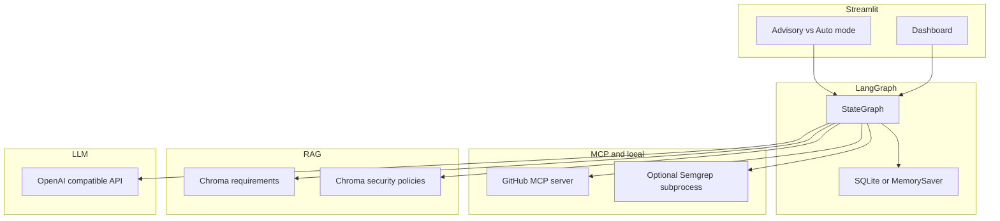
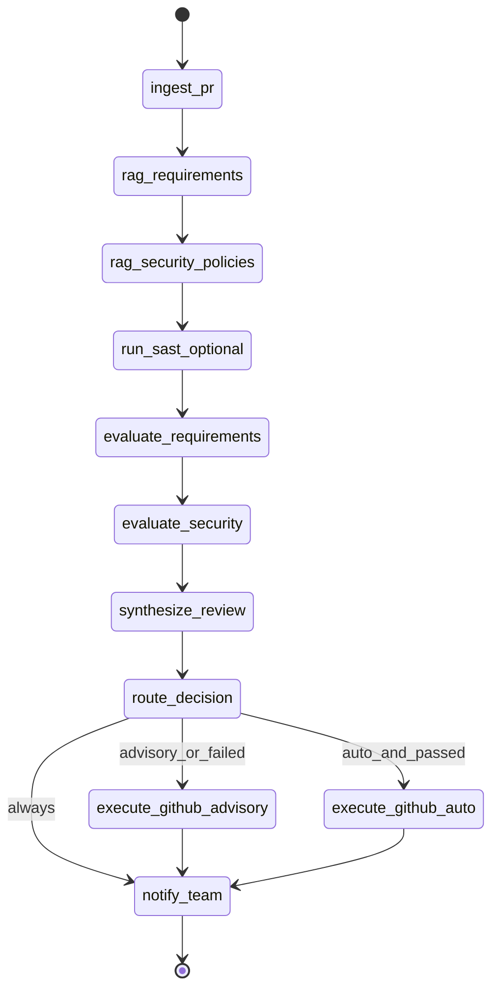

# PR Governance Agent — Validation & Technical Design Plan

## Phase 1 verdict (stringent quality check)

**Verdict: (b) Worth pursuing with a pivot.**

| Criterion | Assessment |
|-----------|------------|
| **Problem** | Real for DE/migration teams: PRs bundle SQL, DAGs, and configs; manual review against PDF/Confluence standards is slow and inconsistent. |
| **Wedge** | Grounded **migration/governance** review (on-prem → BigQuery patterns) + **cited** enterprise docs beats generic Copilot chat; not replacing Dependabot/CodeQL but **complementing** them with policy-aware narrative. |
| **Why now** | Tool-use (MCP), long context, and graph orchestration (LangGraph) make multi-step PR analysis feasible; still needs eval discipline. |
| **Agentic honesty** | Genuinely multi-step (fetch PR → chunk/diff analysis → dual RAG → synthesize → route → notify). Not a single prompt if implemented with separate retrieval passes and conditional edges. |
| **What gets worse** | False positives/negatives on security; hallucinated policy citations; prompt injection via PR description; cost/latency on large diffs; **automated merge** amplifies any mistake. |

### Critical issues in the proposal as written

1. **Auto-approve + auto-merge + email (failure path)** — High risk for enterprise and capstone eval. Branch protection, required reviewers, and SOX-style controls will block merges anyway. **Pivot (your choice):** dual mode in UI/config — **Advisory (default)** vs **Auto-actions (opt-in, sandbox repo only)**.
2. **“Vulnerability scanning” via RAG + LLM only** — Not a substitute for SAST/dependency scanning. Design must add a **deterministic layer** (e.g. Semgrep/Bandit/`pip-audit` or GitHub Advanced Security APIs) and treat RAG as **policy/spec alignment**, not CVE detection.
3. **Scope creep** — PDF + Confluence + GitHub write + email + dashboard + metrics in one POC is 3–4 projects. Capstone POC should nail **one repo, read-heavy GitHub MCP, advisory output**, then layer automation.
4. **Python 3.13** — Repo venv is **3.11** ([`.vscode/settings.json`](e:\AI Learning\Gaurav Sen cohort\capstone\.vscode\settings.json)). Use **3.11** unless you recreate `.venv` on 3.13; avoids dependency friction (some wheels lag on 3.13).
5. **“Production-ready”** — Reframe as **POC-ready**: typed modules, eval harness, feature flags, no prod credentials in repo.

### Refined Phase 0 description (for the design doc)

**User:** ETL/data engineer migrating workloads to BigQuery, reviewing migration PRs before merge.

**System:** Agent ingests PR via **GitHub MCP**, runs **requirements RAG** + **security-policy RAG** (and optional **SAST**), produces a **scored review brief** with citations. User selects **Advisory** (comment draft only) or **Auto** (approve/merge/email — sandbox only).

**Out of scope for v1:** org-wide multi-repo, live Confluence write, unsupervised prod merge.

---

## Feasibility: stack integration



| Integration | Feasible? | Bottleneck / mitigation |
|-------------|-----------|-------------------------|
| **Streamlit + LangGraph** | Yes | Long runs block Streamlit reruns → run graph in **background thread** or `st.status` + poll; persist `thread_id` in `st.session_state`; cap diff size (max files/lines). |
| **LangGraph + MCP** | Yes | Use **langchain-mcp-adapters** or MCP client spawning `npx @modelcontextprotocol/server-github` (or official GitHub MCP). Cold start + stdio latency → cache PR payload in graph state after `ingest_pr`. |
| **LangGraph + Chroma** | Yes | Separate collections `requirements`, `security_policies`; ingest offline CLI; version index with `index_manifest.json`. |
| **Chroma + PDF/Confluence** | Yes with constraints | PDF: `pypdf` + chunk by heading; Confluence: **export HTML/Markdown** for POC (API/MCP optional in v2). |
| **MCP merge/approve** | Technically yes | **Policy blocker:** branch protection; use PAT with minimal scope; **feature flag** `ALLOW_WRITE_ACTIONS`; default off. |
| **Email** | Yes | SMTP via env vars; POC can **log to file** or Mailhog; do not hardcode secrets. |

**No hard blocker** on connecting the four layers; main risk is **operational** (false merge, bad security signal), not library incompatibility.

---

## LangGraph state schema (conceptual)

```python
# TypedDict / dataclass sketch for design doc
class PRReviewState(TypedDict):
    # Inputs
    pr_url: str
    repo: str
    pr_number: int
    mode: Literal["advisory", "auto"]  # user choice A vs C

    # GitHub MCP outputs
    pr_metadata: dict
    changed_files: list[str]
    patches: list[dict]  # truncated/summarized if huge
    ci_status: dict | None

    # RAG contexts (with source ids for citations)
    requirements_chunks: list[RetrievalChunk]
    security_policy_chunks: list[RetrievalChunk]

    # Analysis outputs
    requirements_findings: list[Finding]
    security_findings: list[Finding]
    sast_findings: list[Finding]  # deterministic
    overall_risk: Literal["low", "medium", "high", "blocked"]
    review_markdown: str

    # Routing
    passed: bool
    blockers: list[str]

    # Actions (only if mode==auto and ALLOW_WRITE_ACTIONS)
    github_actions_taken: list[str]
    notification_sent: bool
    errors: list[str]

    # Observability
    token_usage: dict
    node_timings: dict
```

### Graph nodes and edges

| Node | Responsibility |
|------|----------------|
| `ingest_pr` | MCP: PR metadata, file list, diffs (truncate) |
| `rag_requirements` | Query Chroma with PR summary + file paths |
| `rag_security_policies` | Query Chroma for policy rules (not CVE DB) |
| `run_sast_optional` | Semgrep/Bandit on changed paths (sandbox checkout or patch apply) |
| `evaluate_requirements` | LLM structured output vs retrieved chunks |
| `evaluate_security` | LLM + merge SAST results |
| `synthesize_review` | Single markdown brief with citations |
| `route_decision` | Conditional: `passed` ∧ mode |
| `execute_github_advisory` | MCP: post PR review comment (advisory always allowed) |
| `execute_github_auto` | MCP: approve + merge (gated) |
| `notify_team` | Email or webhook stub |



**Checkpointing:** `SqliteSaver` under `data/checkpoints/` for replay/debug and Streamlit “resume run”.

---

## Recommended folder structure

Add under capstone root (keeps planner skill separate in [`.cursor/skills/capstone-poc-planner/`](e:\AI Learning\Gaurav Sen cohort\capstone\.cursor\skills\capstone-poc-planner\)):

```
capstone/
├── docs/
│   └── pr-governance-agent-technical-design.md   # DELIVERABLE (this plan)
├── src/
│   └── pr_governance_agent/
│       ├── __init__.py
│       ├── config.py              # pydantic-settings: mode, flags, API keys
│       ├── state.py               # PRReviewState TypedDict
│       ├── graph/
│       │   ├── builder.py         # StateGraph wiring
│       │   └── nodes/             # one module per node
│       ├── mcp/
│       │   ├── github_client.py   # MCP session lifecycle
│       │   └── tools.py           # thin wrappers
│       ├── rag/
│       │   ├── chroma_store.py
│       │   ├── ingest_pdf.py
│       │   └── ingest_markdown.py
│       ├── security/
│       │   └── sast_runner.py     # optional Semgrep
│       ├── notifications/
│       │   └── email.py
│       └── metrics/
│           └── usage.py           # token/cost logging
├── app/
│   └── streamlit_app.py           # UI: PR URL, mode toggle, run, results
├── scripts/
│   ├── ingest_docs.py             # build Chroma indexes
│   ├── run_graph_cli.py           # headless test without UI
│   └── sync_cursor_rules.py       # existing
├── data/
│   ├── chroma/                    # gitignored
│   ├── checkpoints/               # gitignored
│   └── sample_corpus/             # committed sample PDFs/md
├── eval/
│   ├── cases.yaml                 # PR fixtures + expected outcomes
│   └── run_eval.py
├── tests/
├── pyproject.toml or requirements.txt
└── .env.example
```

---

## Deliverable: markdown file contents (to write after plan approval)

Create **[`docs/pr-governance-agent-technical-design.md`](e:\AI Learning\Gaurav Sen cohort\capstone\docs\pr-governance-agent-technical-design.md)** with sections:

1. Executive summary + Phase 1 verdict (pivot: dual mode)
2. Problem, user, POC scope / non-goals
3. Architecture diagram + data flow
4. LangGraph state + node specs + conditional routing
5. MCP: GitHub server choice, tool list (read vs write), auth, rate limits
6. RAG: ingestion pipeline, chunking, dual collections, citation format
7. Security: RAG vs SAST responsibilities (table)
8. Streamlit UX: mode toggle (Advisory / Auto), run status, review display
9. Config & feature flags (`ALLOW_WRITE_ACTIONS`, `SMTP_*`, `OPENAI_*`)
10. Eval plan (6–8 cases) + metrics (groundedness, tool-call correctness, false merge rate = 0 in advisory)
11. Risks & mitigations (hallucination, injection, cost, large PRs)
12. Resource estimate (hours, API $)
13. Week-1 implementation order
14. Appendix: dependencies list (langgraph, langchain-openai, chromadb, streamlit, mcp)

Align tone with [Phase 7 template](e:\AI Learning\Gaurav Sen cohort\capstone\.cursor\skills\capstone-poc-planner\phases\07-generate-spec.mdc) where useful, but this doc is **technical design** (may include implementation snippets).

---

## First implementation step (boilerplate — after doc approved)

1. Add `pyproject.toml` / `requirements.txt` (Python **3.11**), `.env.example`.
2. Implement minimal packages:
   - [`src/pr_governance_agent/state.py`](e:\AI Learning\Gaurav Sen cohort\capstone\src\pr_governance_agent\state.py) — `PRReviewState`
   - [`src/pr_governance_agent/rag/chroma_store.py`](e:\AI Learning\Gaurav Sen cohort\capstone\src\pr_governance_agent\rag\chroma_store.py) — persistent client + `get_or_create_collection`
   - [`src/pr_governance_agent/graph/builder.py`](e:\AI Learning\Gaurav Sen cohort\capstone\src\pr_governance_agent\graph\builder.py) — graph with **stub nodes** (pass-through) + `MemorySaver`
   - [`scripts/run_graph_cli.py`](e:\AI Learning\Gaurav Sen cohort\capstone\scripts\run_graph_cli.py) — invoke with fake PR state
3. **Defer** GitHub MCP wiring to step 2; stub `ingest_pr` with fixture JSON.
4. Seed [`data/sample_corpus/`](e:\AI Learning\Gaurav Sen cohort\capstone\data\sample_corpus\) with 2–3 markdown migration policy files (BigQuery partitioning, PII, dialect rules).

---

## Dependency highlights (for design doc)

- `langgraph`, `langchain-core`, `langchain-openai`
- `chromadb`, `pypdf` (PDF), `tiktoken`
- `streamlit`, `pydantic-settings`
- `langchain-mcp-adapters` or `mcp` SDK (confirm version at install time)
- Optional: `semgrep` CLI in PATH for SAST node

---

## What we will NOT do in the first PR of code

- Live Confluence API (use exported docs in v1)
- Prod auto-merge enabled by default
- Full email production setup (stub first)
