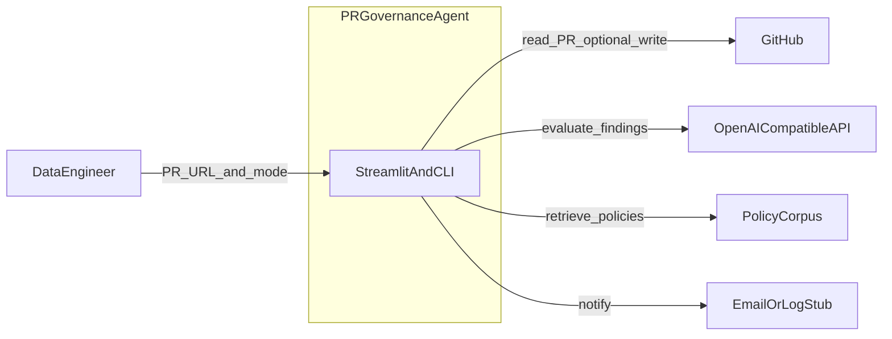
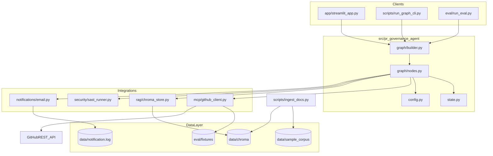
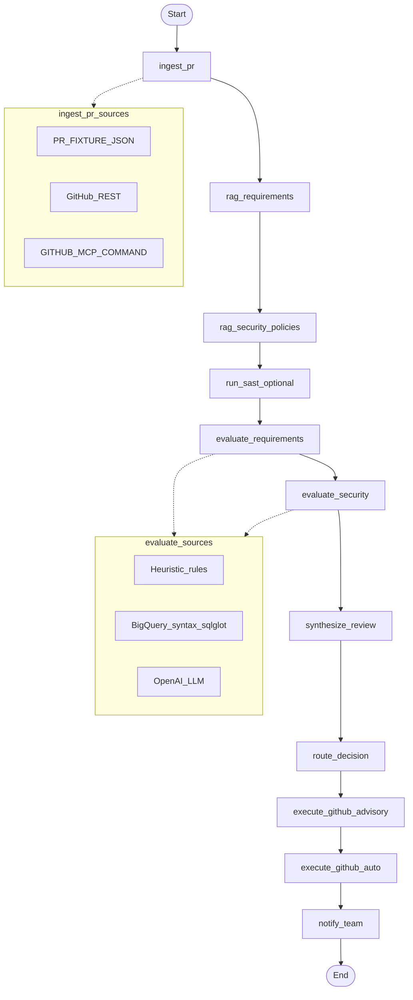
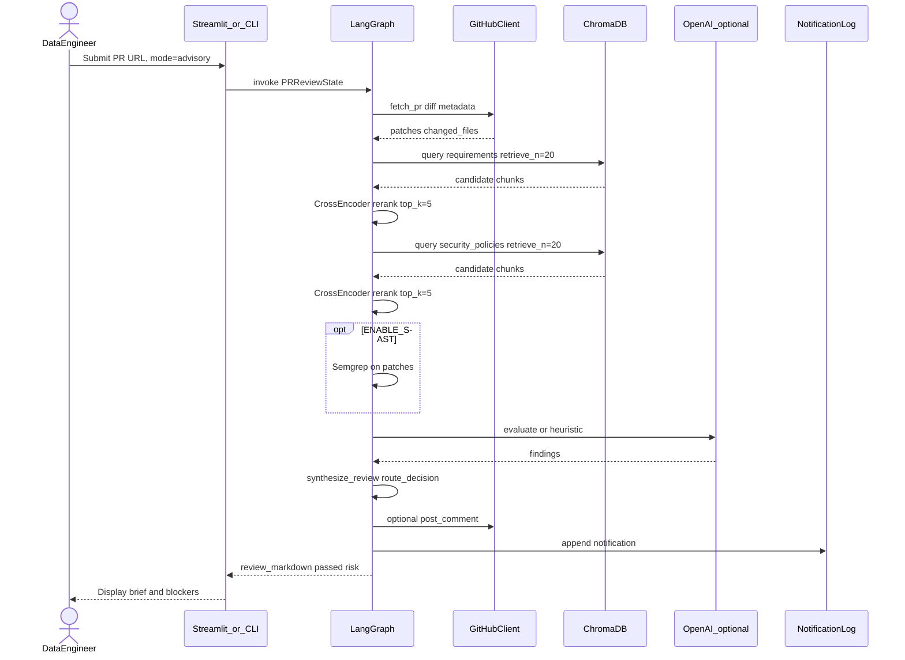
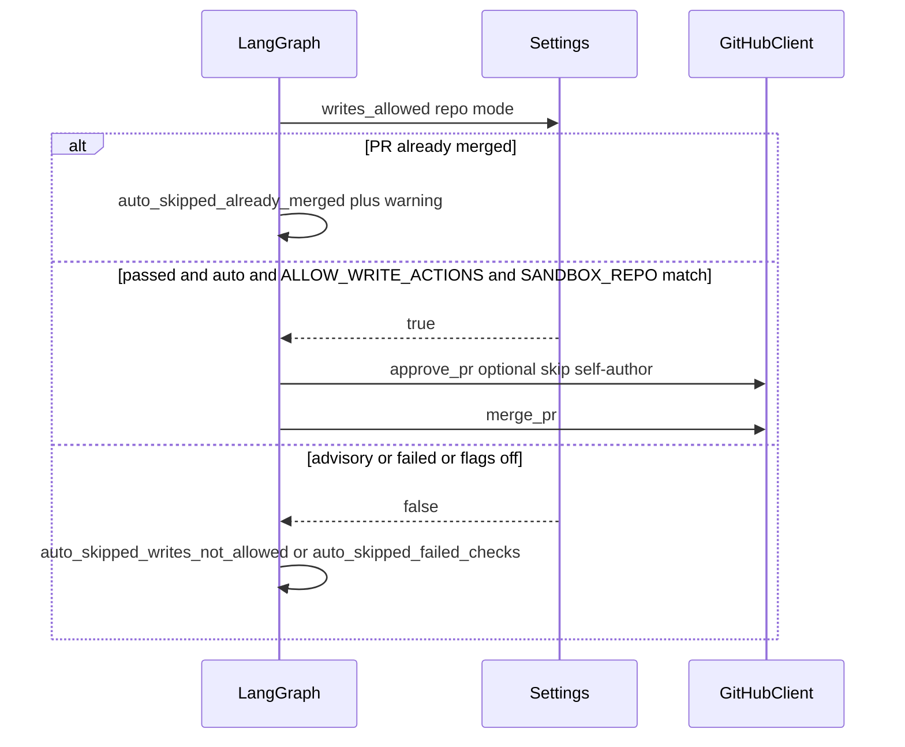
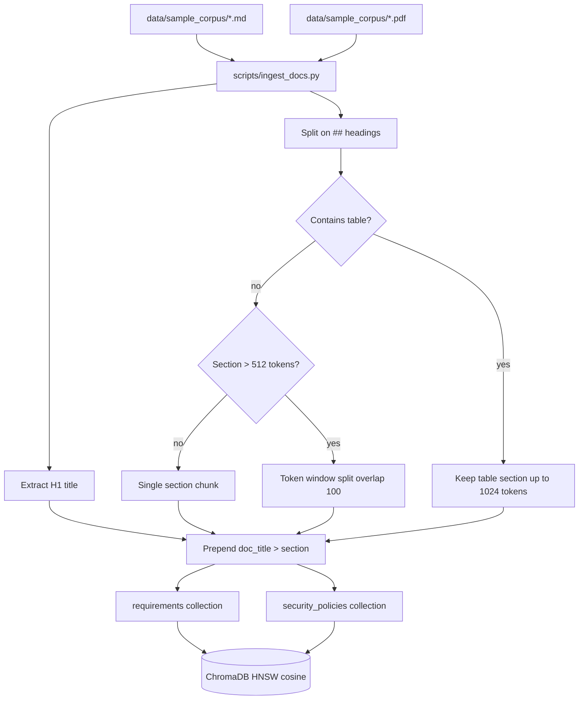
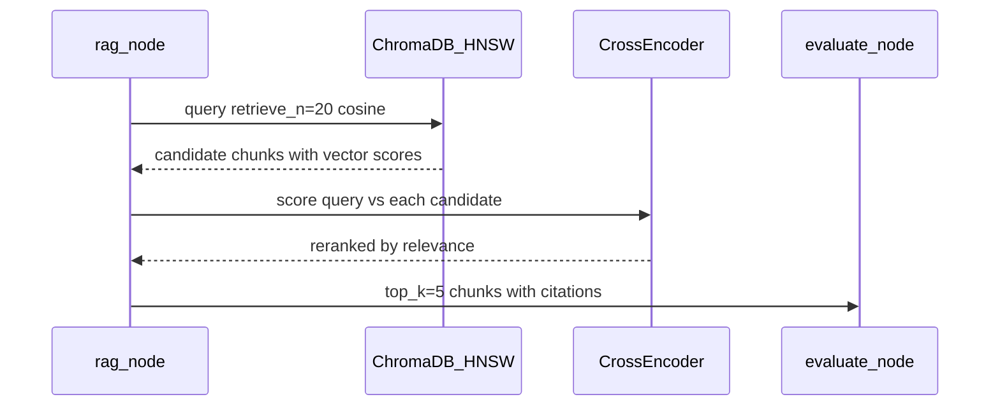
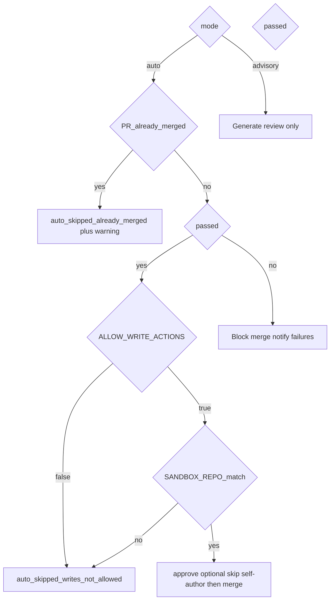

# PR Governance Agent — Architecture Diagrams

Visual reference for the capstone application. Implementation lives under [`src/pr_governance_agent/`](../src/pr_governance_agent/).

**Related:** [Technical design](pr-governance-agent-technical-design.md)

---

## 1. System context

Who uses the system and what it connects to.



---

## 2. Container view

Major deployable parts inside the repository.



---

## 3. LangGraph agent pipeline

Linear state machine executed on each review run (`PRReviewState`).



| Node | Reads | Writes to state |
|------|--------|-----------------|
| `ingest_pr` | GitHub / fixture | `patches`, `changed_files`, `pr_metadata` |
| `rag_requirements` | Chroma `requirements` | `requirements_chunks` |
| `rag_security_policies` | Chroma `security_policies` | `security_policy_chunks` |
| `run_sast_optional` | Patches, Semgrep CLI | `sast_findings` |
| `evaluate_requirements` | Chunks + patches | `requirements_findings` (incl. `sql_syntax`) |
| `evaluate_security` | Chunks + patches + SAST | `security_findings` |
| `synthesize_review` | All findings | `review_markdown` |
| `route_decision` | Findings | `passed`, `blockers`, `overall_risk` |
| `execute_github_advisory` | Review | `github_actions_taken` |
| `execute_github_auto` | Mode + flags | merge/approve or skip |
| `notify_team` | Review | `notification_sent` |

---

## 4. Sequence — advisory review

Typical path for a data engineer (default mode).



---

## 5. Sequence — auto mode (sandbox)

Write actions only when explicitly enabled.



---

## 6. RAG ingestion (offline)

How policy documents enter the vector store.



**Chunking rationale:** Sample corpus files are short policy markdown with one rule per `##` section. Section-first chunking preserves rule boundaries and keeps the dialect conversion table intact. Token-bounded fallback handles future long Confluence exports.

---

## 7. Repository layout (implementation map)

```
capstone/
├── app/streamlit_app.py          # GUI entry
├── scripts/
│   ├── run_graph_cli.py          # CLI entry
│   └── ingest_docs.py            # RAG bootstrap
├── eval/                         # Offline test cases
├── src/pr_governance_agent/
│   ├── graph/                    # LangGraph builder + nodes
│   ├── sql/bigquery_validator.py # BigQuery SQL syntax on PR diffs
│   ├── mcp/github_client.py      # GitHub REST / fixture / MCP hook
│   ├── rag/chroma_store.py       # HNSW retrieval + rerank orchestration
│   ├── rag/reranker.py           # CrossEncoder reranking
│   ├── rag/ingest_markdown.py    # Section-first chunking
│   ├── security/sast_runner.py   # Optional Semgrep
│   └── notifications/email.py    # SMTP or log stub
└── data/
    ├── chroma/                   # Persisted embeddings
    └── sample_corpus/            # Source policies
```

---

## 8. RAG retrieval (online)

Two-stage pipeline used by `rag_requirements` and `rag_security_policies` nodes.



**Why HNSW:** Small policy corpus (tens to hundreds of chunks), sub-ms latency, cosine matches default embeddings. Wide recall (N=20) compensates for approximate search; cross-encoder reranking improves precision before LLM eval.

**Fallback:** If reranker model fails to load, return vector-order top-k.

---

## 9. Configuration gates



---

## Viewing these diagrams

- **Cursor / VS Code:** Markdown preview renders Mermaid.
- **GitHub:** Mermaid blocks render in this file when pushed.
- **Export PNG:** Use [Mermaid Live Editor](https://mermaid.live) and paste a diagram block.

---

*Last updated: June 2026 — aligned with implemented codebase in `src/pr_governance_agent/`.*
