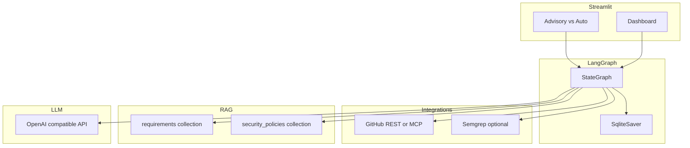
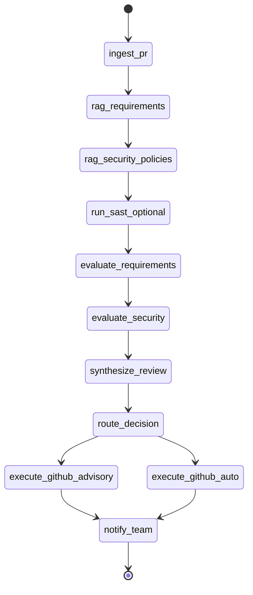

# PR Governance Agent — Technical Design

> Generated for capstone POC. Agentic PR review for data-engineering migration work (on-prem → BigQuery) with RAG, optional SAST, and GitHub integration.

## 1. Executive summary

**Verdict (Phase 1): (b) Worth pursuing with a pivot.**

The core idea—an agent that reviews GitHub PRs against enterprise requirements and security policies using RAG—is sound for ETL/migration teams. The original spec’s **unsupervised auto-approve and auto-merge** must not be the default: use **Advisory mode** (draft review + optional PR comment) by default, and **Auto mode** only on sandbox repos with `ALLOW_WRITE_ACTIONS=true`.

**POC hypothesis:** Grounded, cited PR review briefs reduce missed governance issues on migration PRs compared to ad-hoc human skim.

---

## 2. Problem, user, scope

### User

ETL / data engineer on a program migrating pipelines and SQL from on-prem databases to **GCP BigQuery**, reviewing PRs that touch SQL, Airflow/Composer DAGs, dbt models, and IaC.

### Problem

Manual PR review against PDF/Confluence standards (partitioning, PII, dialect conversion, cost controls) is slow and inconsistent. Security policy alignment is often separate from “does this SQL match our migration playbook?”

### In scope (v1)

- Single GitHub repo (or fixture-based offline runs)
- Read PR metadata, file list, diffs (truncated)
- Dual Chroma collections: `requirements`, `security_policies`
- LangGraph orchestration with checkpointing
- Streamlit UI: PR URL, **Advisory / Auto** mode toggle
- Optional Semgrep when installed
- Email/notification stub (log file)
- Eval harness with 6+ labeled cases

### Out of scope (v1)

- Org-wide multi-repo scanning
- Live Confluence API (use exported markdown/PDF in corpus)
- Unsupervised production merge
- Replacing Dependabot/CodeQL (SAST is supplementary)

---

## 3. Architecture

**Full diagrams (system, container, sequence, LangGraph):** [pr-governance-agent-architecture.md](pr-governance-agent-architecture.md)



### Data flow

1. User submits PR URL + mode in Streamlit.
2. `ingest_pr` fetches PR (GitHub API or fixture).
3. `rag_requirements` / `rag_security_policies` retrieve top-k chunks.
4. `run_sast_optional` runs Semgrep if enabled.
5. `evaluate_*` nodes call LLM (or heuristic fallback without API key).
6. `synthesize_review` produces markdown brief with citations.
7. `route_decision` sets `passed` and blockers.
8. Advisory path: draft/post comment stub; Auto path: approve/merge gated by flags.
9. `notify_team` writes email stub log.

---

## 4. LangGraph state and nodes

### State (`PRReviewState`)

See [`src/pr_governance_agent/state.py`](../src/pr_governance_agent/state.py) for the TypedDict. Key fields: `pr_url`, `mode`, `changed_files`, `patches`, `requirements_chunks`, `security_policy_chunks`, findings, `review_markdown`, `passed`, `blockers`, `github_actions_taken`, `errors`, `token_usage`, `node_timings`.

### Nodes

| Node | Responsibility |
|------|----------------|
| `ingest_pr` | Fetch PR; truncate large diffs |
| `rag_requirements` | Chroma query on requirements collection |
| `rag_security_policies` | Chroma query on security policies |
| `run_sast_optional` | Semgrep subprocess if available |
| `evaluate_requirements` | LLM/heuristic vs retrieved chunks |
| `evaluate_security` | Merge policy + SAST findings |
| `synthesize_review` | Markdown brief |
| `route_decision` | Set `passed`, `blockers` |
| `execute_github_advisory` | Comment draft / post if enabled |
| `execute_github_auto` | Approve/merge if `mode=auto` and flags allow |
| `notify_team` | Email stub |

### Routing



Checkpoints: `data/checkpoints/` via `SqliteSaver`.

---

## 5. GitHub integration (MCP / REST)

- **Primary (POC):** GitHub REST API via `httpx` + `GITHUB_TOKEN` (read PR, diff, optional comment).
- **Optional:** MCP GitHub server (`GITHUB_MCP_COMMAND`) for tool-standardized access; same operations behind `GitHubClient` interface.
- **Offline:** `USE_PR_FIXTURE=true` loads `eval/fixtures/sample_pr.json`.

**Write tools (approve, merge):** only when `mode=auto`, `ALLOW_WRITE_ACTIONS=true`, and repo allowlisted via `SANDBOX_REPO`.

**Rate limits:** cache PR payload in state after `ingest_pr`; cap files at `MAX_DIFF_FILES`, lines at `MAX_DIFF_LINES`.

---

## 6. RAG (ChromaDB)

| Collection | Content |
|------------|---------|
| `requirements` | Migration playbooks, BQ partitioning, naming, dialect rules |
| `security_policies` | PII handling, secrets, access patterns |

**Ingestion:** `python scripts/ingest_docs.py` — markdown from `data/sample_corpus/`, optional PDF via `pypdf`.

### Chunking strategy (section-first, size-bounded fallback)

After reviewing the sample corpus (`bigquery_migration_requirements.md`, `dialect_conversion_guide.md`, `security_pii_policy.md`), each file uses an H1 title plus `##` sections with one governance rule per section (~20–40 words). The dialect guide includes a markdown mapping table that must stay intact.

**Primary unit:** one `##` section = one chunk when ≤ 512 tokens.

| Parameter | Value | Notes |
|-----------|-------|-------|
| Max section tokens | 512 | Token count via `tiktoken` (`cl100k_base`) |
| Table section hard cap | 1024 | Keeps Oracle→BigQuery table whole |
| Fallback overlap | 100 tokens | Only when a section exceeds max tokens |
| Context prefix | `{H1} > {section}\n\n` | Fixes previously dropped document titles |
| Metadata | `source`, `section`, `doc_title` | Used in review citations |

**PDF path:** split on `#` headings or ALL-CAPS lines; fall back to token-window on flat text.

Implementation: [`src/pr_governance_agent/rag/ingest_markdown.py`](../src/pr_governance_agent/rag/ingest_markdown.py).

### Vector index: HNSW + cosine

Chroma collections use **HNSW** (Hierarchical Navigable Small World) with **cosine** distance. This fits the POC because:

- Corpus is small (~11 chunks today; expected tens to low hundreds)
- Sub-millisecond query latency with no extra ops overhead
- Cosine space matches Chroma's default embedding model (`all-MiniLM-L6-v2`)
- Dual collections keep each search graph small

HNSW tuning constants in [`chroma_store.py`](../src/pr_governance_agent/rag/chroma_store.py): `construction_ef=100`, `search_ef=50`.

### Two-stage retrieval (retrieve → rerank → top-k)

1. **Wide recall:** HNSW query with `RAG_RETRIEVE_N=20` (default)
2. **Re-rank:** `sentence-transformers` CrossEncoder (`cross-encoder/ms-marco-MiniLM-L-6-v2`) scores query–passage pairs
3. **Final top-k:** Return `RAG_TOP_K=5` chunks to LLM eval and citations

Cross-encoder score replaces vector similarity in `RetrievalChunk.score`; original vector score preserved as `vector_score` for debugging. If the reranker fails to load, fall back to vector order.

| Variable | Default | Purpose |
|----------|---------|---------|
| `RAG_RETRIEVE_N` | 20 | Wide recall from HNSW |
| `RAG_TOP_K` | 5 | Chunks passed to eval nodes |
| `RAG_RERANK_ENABLED` | true | Toggle cross-encoder reranking |
| `RAG_RERANK_MODEL` | `cross-encoder/ms-marco-MiniLM-L-6-v2` | Reranker model |

**Citations:** `[source:section]` in review markdown (includes doc title in chunk text).

---

## 7. Security: RAG vs SAST

| Concern | RAG + LLM | SAST (Semgrep) |
|---------|-----------|----------------|
| Policy alignment (“must partition by date”) | Yes | No |
| Known anti-patterns in custom rules | Partial | Yes |
| CVE / dependency vulnerabilities | No | Partial (with supply-chain rules) |
| Hallucinated CVE | Risk | Low |

**Rule:** Never claim “no vulnerabilities” from RAG alone. SAST optional; failures logged, not blocking install.

---

## 8. Streamlit UX

- PR URL input
- Radio: **Advisory** (default) vs **Auto**
- Run button → background graph invocation
- Progress via `st.status`
- Results: risk badge, blockers list, review markdown, actions taken
- Warning banner when Auto + `ALLOW_WRITE_ACTIONS`

---

## 9. Configuration

| Variable | Purpose |
|----------|---------|
| `OPENAI_API_KEY` | LLM |
| `OPENAI_MODEL` | Default `gpt-4o-mini` |
| `GITHUB_TOKEN` | API access |
| `ALLOW_WRITE_ACTIONS` | `false` default |
| `SANDBOX_REPO` | `owner/repo` allowlist for writes |
| `USE_PR_FIXTURE` | Offline PR data |
| `CHROMA_PERSIST_DIR` | `data/chroma` |
| `RAG_RETRIEVE_N` | Wide recall before rerank (default 20) |
| `RAG_TOP_K` | Final chunks after rerank (default 5) |
| `RAG_RERANK_ENABLED` | Cross-encoder reranking toggle |
| `RAG_RERANK_MODEL` | Reranker model name |
| `ENABLE_SAST` | Run Semgrep if true |
| `SMTP_*` | Optional email (stub uses log file) |

---

## 10. Eval plan

| # | Case | Expected |
|---|------|----------|
| 1 | Clean partitioning PR | Pass, low risk |
| 2 | `ROWNUM` dialect leak | Fail requirements |
| 3 | Raw PII column | Fail security, blocked |
| 4 | Missing partition filter on large table | Medium/blocker |
| 5 | PR body claims no PII, diff adds email | Red-team fail |
| 6 | Advisory mode | No merge actions |
| 7 | Auto mode + fixture pass | Actions logged only if flags on |
| 8 | Empty diff | Graceful message |

**Metrics:** post-rerank retrieval recall@5 on labeled queries; zero false merges in advisory; tool success rate for `ingest_pr`.

---

## 11. Risks and mitigations

| Risk | Mitigation |
|------|------------|
| Hallucinated policy | Require chunk ids in findings; eval groundedness |
| Prompt injection in PR body | Separate system prompt; ignore instructions in diff |
| Large PR OOM | Truncate diffs; summarize per-file |
| False auto-merge | Default advisory; sandbox allowlist |
| Cost | `gpt-4o-mini`; cap tokens per node |

---

## 12. Resource estimate

| Phase | Hours (low–high) |
|-------|------------------|
| Graph + stubs | 8–12 |
| RAG ingest + corpus | 4–6 |
| GitHub + fixtures | 6–10 |
| LLM eval nodes | 8–12 |
| Streamlit | 4–6 |
| Eval harness | 6–8 |
| **Total** | **36–54** |

**API (dev):** ~$20–60 for iterative testing with mini model.

---

## 13. Week-1 order

1. `requirements.txt`, config, state, graph stubs, CLI
2. Sample corpus + `ingest_docs.py`
3. Wire `ingest_pr` + fixtures
4. RAG nodes + heuristic eval (no API key)
5. Streamlit read-only path
6. Eval YAML + runner

---

## 14. Dependencies

```
langgraph>=0.2.60
langchain-core>=0.3.0
langchain-openai>=0.2.0
chromadb>=0.5.0
sentence-transformers>=3.0.0
tiktoken>=0.7.0
streamlit>=1.28.0
pydantic-settings>=2.0.0
pypdf>=4.0.0
httpx>=0.27.0
pyyaml>=6.0.0
python-dotenv>=1.0.0
```

Optional: Semgrep CLI, Node.js for GitHub MCP server.

---

*Aligns with capstone POC planner phases. Building is a separate session from planner Phases 2–6 research approval.*
