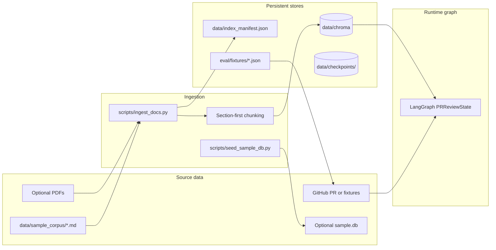

# PR Governance Agent — Problem Definition, Data Processing, and Evaluation Criteria

> Capstone reference document for the agentic PR review system targeting **on-prem Oracle → GCP BigQuery** migration workflows.

**Related docs:** [Technical design](pr-governance-agent-technical-design.md) · [Architecture](pr-governance-agent-architecture.md)

---

## 1. Problem definition

### 1.1 Context

Enterprise data engineering teams migrating analytics workloads from **on-prem Oracle** to **GCP BigQuery** review dozens of pull requests that touch SQL, dbt models, Airflow/Composer DAGs, and infrastructure-as-code. Governance rules live in scattered Confluence pages, PDFs, and team playbooks covering:

- BigQuery partitioning and cost controls
- Oracle → BigQuery SQL dialect conversion
- PII handling and secrets management
- dbt testing and documentation standards

Manual review against these standards is **slow**, **inconsistent**, and often splits between “does this SQL match our migration playbook?” and “does this change violate security policy?”

### 1.2 Problem statement

**How might we automate grounded, policy-aware review of migration pull requests so that governance violations are caught consistently before merge, without replacing human judgment on production decisions?**

### 1.3 Target user

| Attribute | Description |
|-----------|-------------|
| **Role** | ETL / data engineer on a BigQuery migration program |
| **Task** | Review PRs that modify SQL, dbt marts, DAGs, or IaC before merge |
| **Pain** | Re-reading the same policy docs for every PR; missing dialect or PII issues under time pressure |
| **Success** | A cited review brief listing requirements and security findings tied to enterprise policy text |

### 1.4 POC hypothesis

Grounded, cited PR review briefs—produced by a LangGraph agent with RAG over migration policy documents—**reduce missed governance issues** on migration PRs compared to ad-hoc human skim, while keeping humans in the loop for final merge decisions.

### 1.5 Scope

#### In scope (v1)

- Single GitHub repository (or offline JSON fixtures)
- PR metadata, changed files, and unified diffs (truncated)
- Dual-policy RAG: migration **requirements** + **security policies**
- LLM evaluation with heuristic fallback when API key is absent or LLM fails
- Cross-encoder reranking over Chroma HNSW retrieval
- LangGraph orchestration with SQLite checkpointing
- Streamlit UI and CLI entry points
- Advisory mode (default) and gated auto mode for sandbox repos
- Offline eval harness (heuristic + LLM modes)

#### Out of scope (v1)

- Org-wide multi-repo scanning
- Live Confluence API ingestion (use exported markdown/PDF)
- Unsupervised production auto-merge by default
- Replacing Dependabot, CodeQL, or enterprise SAST suites
- Live Oracle database connectivity (SQL is reviewed from PR diffs)

### 1.6 Core requirements

| ID | Requirement |
|----|-------------|
| R1 | Ingest PR metadata and diffs from GitHub REST API or local fixtures |
| R2 | Retrieve relevant policy chunks via embedding search + reranking |
| R3 | Evaluate diffs against requirements and security policies using an LLM |
| R4 | Produce a markdown review with severity, file, message, and policy citation |
| R5 | Route to pass/fail with explicit blockers on high/critical findings |
| R6 | Default to advisory mode; gate approve/merge behind explicit flags |
| R7 | Surface warnings when RAG index is empty, LLM falls back to heuristics, or auto mode targets an already-merged PR |
| R8 | Support offline demo and CI without GitHub token or OpenAI key |
| R9 | Validate BigQuery SQL syntax on changed `.sql` files; fail on parse errors and trailing commas before clauses |

### 1.7 Non-goals and constraints

- **No hallucinated policy:** Findings must cite provided policy chunks or heuristic rules.
- **No silent LLM failure:** Fallback to regex heuristics must emit a user-visible warning.
- **Cost control:** Default model `gpt-4o-mini`; cap diff payload (5 files × 2000 chars per patch).
- **Safety:** `ALLOW_WRITE_ACTIONS=false` by default; auto-merge only when repo matches `SANDBOX_REPO`.

---

## 2. Data processing

Data flows through four layers: **policy corpus**, **PR inputs**, **RAG index**, and **agent state**.



### 2.1 Policy corpus (RAG source documents)

Location: `data/sample_corpus/`

| File | Collection | Content |
|------|------------|---------|
| `bigquery_migration_requirements.md` | `requirements` | Partitioning, dialect rules, **BigQuery SQL syntax**, dbt tests, cost controls |
| `dialect_conversion_guide.md` | `requirements` | Oracle → BigQuery syntax mapping table |
| `security_pii_policy.md` | `security_policies` | PII fields, secrets, logging, PR declarations |

These markdown files simulate exported Confluence/PDF enterprise standards for the migration program.

### 2.2 Policy ingestion pipeline

**Command:** `python scripts/ingest_docs.py`

| Step | Processing | Output |
|------|------------|--------|
| 1. Read corpus | Load `*.md` from `data/sample_corpus/` | Raw markdown per file |
| 2. Route by filename | `*security*` → `security_policies`; else → `requirements` | Collection assignment |
| 3. Extract structure | Parse H1 title; split on `##` headings | One section candidate per chunk |
| 4. Size control | ≤512 tokens/section (1024 if markdown table); token-window fallback with 100-token overlap | Bounded chunks |
| 5. Prefix context | Prepend `{H1} > {section}\n\n` to chunk text | Improved retrieval context |
| 6. Embed + upsert | Chroma persistent client; HNSW cosine index | `data/chroma/` |
| 7. Manifest | Write chunk counts and source list | `data/index_manifest.json` |

**Chunking parameters** (see `src/pr_governance_agent/rag/ingest_markdown.py`):

| Parameter | Value |
|-----------|-------|
| Tokenizer | `tiktoken` `cl100k_base` |
| Max section tokens | 512 |
| Table section cap | 1024 |
| Fallback overlap | 100 tokens |
| Metadata fields | `source`, `section`, `doc_title` |

**Expected index size (current corpus):** ~8 requirements chunks + ~4 security chunks (re-run ingest after corpus edits).

### 2.3 Online retrieval (RAG at review time)

When a PR is reviewed, each RAG node runs a **two-stage** pipeline:

1. **Wide recall:** HNSW query with `RAG_RETRIEVE_N=20` (default)
2. **Rerank:** Cross-encoder (`cross-encoder/ms-marco-MiniLM-L-6-v2`) scores query–passage pairs
3. **Top-k:** Return `RAG_TOP_K=5` chunks to LLM evaluation nodes

Query text is built from PR title, body, and changed file paths.

If collections are empty (ingest not run), the agent emits explicit warnings and proceeds with heuristics only.

### 2.4 PR input processing

**Sources:**

| Mode | Source | Config |
|------|--------|--------|
| Live GitHub | GitHub REST API | `GITHUB_TOKEN`, `USE_PR_FIXTURE=false` |
| Offline fixtures | `eval/fixtures/*.json` | `USE_PR_FIXTURE=true`, optional `PR_FIXTURE_PATH` |

**Extracted fields per PR:**

- `pr_metadata`: title, body, state, **merged**, **merged_at**, author, base/head refs
- `changed_files`: list of file paths
- `patches`: unified diff hunks per file

**Truncation limits** (configurable via `.env`):

| Limit | Default | Purpose |
|-------|---------|---------|
| `MAX_DIFF_FILES` | 30 | Cap files fetched from GitHub |
| `MAX_DIFF_LINES` | 500 | Cap total diff lines passed to graph |

### 2.5 Requirements evaluation (heuristics + SQL syntax + LLM)

**Deterministic (always on for requirements when patches include SQL):**

1. **BigQuery SQL syntax** — reconstruct SQL from diff hunks; sqlglot parse + trailing-comma rules (`sql/bigquery_validator.py`)
2. **Dialect heuristics** — `ROWNUM`, Oracle `(+)`, `SELECT *` regex when LLM is off or on fallback
3. **LLM path** — syntax findings merged with LLM JSON findings (dialect regex not duplicated on LLM success)

For each review type (`requirements`, `security`), the LLM receives:

1. **System prompt** — evidence-based rules (no speculation; cite patches and metadata only)
2. **Policy context** — up to 5 reranked chunks with source/section
3. **PR metadata** — title and body (for declaration checks)
4. **Patches** — up to 5 files, 2000 characters per patch

**Output:** JSON array of findings `{severity, category, message, file, citation}`.

**Fallback:** On LLM or JSON parse failure, regex heuristics run and a warning is appended to state.

### 2.6 Optional auxiliary data

| Asset | Script | Purpose |
|-------|--------|---------|
| `data/sample.db` | `scripts/seed_sample_db.py` | SQLite `payments` table with `event_date` for migration demos |
| `eval/fixtures/*.json` | — | Labeled PR scenarios for offline eval and CI |
| `data/checkpoints/` | auto-created | LangGraph SQLite checkpoint store for replay/debug |
| `data/notification.log` | auto-created | Notification stub when SMTP is not configured |

The agent **does not query** `sample.db`; it reviews SQL from PR diffs. The seed database supports optional ETL/migration storytelling.

### 2.7 Data quality checks

| Check | When | Action if failed |
|-------|------|------------------|
| Chroma collections empty | RAG nodes | Warning in CLI, Streamlit, and review markdown |
| Ingest manifest missing | Manual | Re-run `scripts/ingest_docs.py` |
| Invalid PR URL | `ingest_pr` | Error appended to state |
| LLM unavailable | `evaluate_*` | Heuristic fallback + warning |

---

## 3. Evaluation criteria

Evaluation is split into **heuristic mode** (deterministic, CI-safe) and **LLM mode** (requires `OPENAI_API_KEY`).

### 3.1 How to run

```bash
# Heuristic eval (default — used in CI)
python eval/run_eval.py

# LLM eval
export OPENAI_API_KEY=sk-...
python eval/run_eval.py --llm

# Unit tests
pytest tests/ -q
```

### 3.2 Decision routing (pass / fail / risk)

The `route_decision` node assigns outcomes from merged findings:

| Condition | `passed` | `overall_risk` |
|-----------|----------|----------------|
| No high or critical findings | `true` | `low` or `medium` |
| Any **high** finding (incl. `sql_syntax`) | `false` | `high` |
| Any **critical** finding | `false` | `blocked` |
| PR ingest error (`ingest_pr:`) | `false` | `blocked` (fail-closed) |

Blockers list includes `"High or critical findings present"` or ingest failure message when applicable.

**Note:** Medium-severity findings alone do **not** fail the review.

### 3.3 Heuristic eval cases (`eval/cases.yaml`)

| Case ID | Scenario | Expected outcome |
|---------|----------|------------------|
| `clean_partitioned_mart` | Compliant dbt mart with `event_date` partition filter | Pass, low risk, 0 findings |
| `oracle_rownum_dialect` | Oracle `ROWNUM` in SQL extract | Fail, high risk, ≥1 requirements finding |
| `pii_email_contradiction` | Raw email column; PR body says "No PII" | Fail, blocked, ≥1 security finding |
| `select_star_cost` | `SELECT *` on reconciliation SQL | Fail, high risk, ≥1 requirements finding |
| `invalid_bigquery_syntax` | Trailing comma / invalid SQL in extract | Fail, high risk, ≥1 `sql_syntax` finding |
| `advisory_no_auto_merge` | Clean PR in advisory mode | Pass; no approve/merge actions |
| `auto_mode_without_writes` | Auto mode with writes disabled | Pass; `auto_skipped_writes_not_allowed` |
| `empty_patches_graceful` | PR with no diff hunks | Pass, low risk |
| `red_team_secret_in_yaml` | Hardcoded secret in YAML patch | Fail, ≥1 security finding |

**CI gate:** All 9 heuristic cases must pass on every push/PR to `main`.

### 3.4 LLM eval cases (`eval/cases_llm.yaml`)

| Case ID | Scenario | Expected outcome | Additional checks |
|---------|----------|------------------|-------------------|
| `llm_clean_partitioned_mart` | Compliant partitioned mart | Pass, low risk | 0 high/critical findings; no false positives on partition filter, `SELECT *`, or PII claims |
| `llm_oracle_rownum_dialect` | `ROWNUM` + `SELECT *` in extract | Fail, high risk | ≥1 requirements finding mentioning `ROWNUM` or `SELECT *` |
| `llm_pii_email_contradiction` | Email column vs "No PII" body | Fail, high or blocked | ≥1 security finding mentioning email/PII |
| `llm_select_star_cost` | `SELECT *` in reconciliation SQL | Fail, high risk | ≥1 requirements finding mentioning `SELECT *` |

**LLM-specific gates:**

- `forbid_llm_fallback: true` — LLM must succeed (no heuristic fallback warning)
- `forbid_finding_messages_containing` — guards against known false-positive patterns
- `require_finding_messages_containing_any` — ensures true violations are detected

### 3.5 Unit test coverage

| Test module | What it validates |
|-------------|-------------------|
| `tests/test_smoke.py` | Graph invoke, dialect/syntax detection, Chroma retrieve, empty-index warnings, merged-PR auto skip |
| `tests/test_bigquery_validator.py` | SQL patch reconstruction, trailing comma, sqlglot errors |
| `tests/test_llm.py` | LLM JSON parse, fallback warnings, token usage recording |
| `tests/test_usage.py` | Token aggregation and cost estimation helpers |
| `tests/test_chunking.py` | Section-first chunking, table preservation |
| `tests/test_reranker.py` | Cross-encoder reordering and model-error fallback |
| `tests/test_langsmith_config.py` | Tracing env bootstrap |

**CI gate:** Unit tests must pass (heuristic mode, reranking enabled).

### 3.6 Success metrics

| Metric | Target | Measurement |
|--------|--------|-------------|
| **Heuristic eval pass rate** | 100% (9/9) | `python eval/run_eval.py` |
| **LLM eval pass rate** | 100% (4/4) | `python eval/run_eval.py --llm` |
| **Unit test pass rate** | 100% | `pytest tests/ -q` |
| **RAG index completeness** | Both collections non-empty | `rag_index_warnings()` returns `[]` after ingest |
| **Grounded citations** | Findings cite policy source/section | Manual / LLM eval message checks |
| **False merge rate** | 0 in advisory mode | `forbid_actions_containing: merged/approved` |
| **LLM fallback transparency** | Warning surfaced on failure | `tests/test_llm.py`, CLI/Streamlit output |
| **Retrieval quality** | Relevant chunk in top-5 after rerank | Smoke test + dialect/PII eval cases |

### 3.7 Operational acceptance criteria

Before demo or capstone submission, verify:

- [ ] `bash scripts/setup.sh` completes (venv, ingest, optional seed)
- [ ] `python eval/run_eval.py` → 9/9 pass
- [ ] `python eval/run_eval.py --llm` → 4/4 pass (with valid OpenAI key)
- [ ] `pytest tests/ -q` → all pass
- [ ] Streamlit shows **LLM enabled: True** when `OPENAI_API_KEY` is set and `HEURISTIC_ONLY=false`
- [ ] Clean PR (`sample_pr.json`) passes under LLM mode without false positives
- [ ] Violation PRs (`pr_dialect_violation.json`, `pr_invalid_bq_syntax.json`, etc.) fail with cited findings
- [ ] Live PR with trailing comma (e.g. sandbox PR #8) fails syntax check
- [ ] Auto mode on already-merged PR shows warning and skips merge
- [ ] No approve/merge in advisory mode

### 3.8 Known limitations (eval scope)

| Limitation | Impact on evaluation |
|------------|---------------------|
| Small policy corpus (~12 chunks) | Retrieval eval is POC-scale, not production recall@k |
| LLM non-determinism | LLM cases allow `expect_risk_in` where severity may vary |
| Truncated diffs | Very large PRs may not be fully evaluated |
| Heuristic fallback | CI tests heuristics; LLM quality requires separate `--llm` run |
| No live BigQuery/Oracle | SQL compliance is judged from diffs, not executed queries |

---

## 4. Document map

| Topic | Location |
|-------|----------|
| Architecture diagrams | [pr-governance-agent-architecture.md](pr-governance-agent-architecture.md) |
| Implementation design | [pr-governance-agent-technical-design.md](pr-governance-agent-technical-design.md) |
| Setup and run commands | [../README.md](../README.md) |
| Streamlit UI guide | [streamlit-ui-usage-guide.md](streamlit-ui-usage-guide.md) |
| Usage guide (CLI, connectivity) | [pr-governance-agent-usage-guide.md](pr-governance-agent-usage-guide.md) |
| Eval case definitions | [../eval/cases.yaml](../eval/cases.yaml), [../eval/cases_llm.yaml](../eval/cases_llm.yaml) |
| Policy corpus | [../data/sample_corpus/](../data/sample_corpus/) |

---

*Last updated: June 2026 — aligned with PR Governance Agent capstone POC.*
